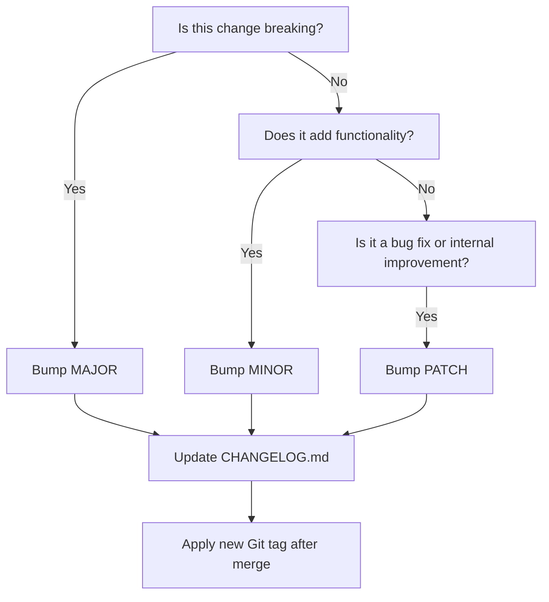

# Versioning & Breaking Changes

## Versioning Strategy

We use [Semantic Versioning 2.0.0](https://semver.org/) for all pipeline template repositories.

**Format:** `MAJOR.MINOR.PATCH` (e.g., `2.4.1`)

- **MAJOR** – Incompatible / breaking changes
- **MINOR** – Backward-compatible features / additions
- **PATCH** – Fixes, internal refactors, docs

## Public API Scope

SemVer compatibility guarantees apply to templates in `pipelines/` and `jobs/` — these are
this repository's **public API**. Everything else (`tasks/`, `stages/`, `utils/`, `schemas/`,
`scripts/`) is internal implementation and may be changed freely, **as long as no public
`pipelines/`/`jobs/` template's parameters, outputs, or documented behaviour change as a
result**. If an internal change is invisible to a consumer of a `pipelines/`/`jobs/`
template, it is not a breaking change in SemVer terms, even if it would be breaking in
isolation.

## Version Segment Guide

| Change Type | Description | Version Segment |
|---|---|---|
| **Breaking Change** | Removes or changes current behaviour; users **must update** their templates | **MAJOR** |
| **New Feature** | Adds new optional behaviour, flags, steps, templates, or parameters | **MINOR** |
| **Patch/Fix** | Bug fixes, refactors that don’t affect output, documentation updates, internal cleanup | **PATCH** |

## Examples

All the examples listed below are placed in the worst case scenario category. For example, an item in the breaking change list could in certain cases not be a breaking change. This list should be used as a guideline; only through testing will breaking changes be fully understood.

### MAJOR (Breaking Changes)

| Example | Why |
|---|---|
| Removing a parameter | User templates will fail unless updated |
| Renaming a parameter | Breaks backwards compatibility |
| Changing default value of a parameter from `true` to `false` (or vice versa) | May silently change behaviour |
| Changing the name of a `stage`, `job`, or `step` relied on in condition expressions | Could cause existing references to break |
| Altering a required input parameter to behave differently | Could cause misconfigured pipelines |
| Replacing an entire job with a differently structured one | Requires consumers to restructure usage |
| Moving required logic to a separate template without maintaining backwards compatibility | Users may need to import or call templates differently |
| Switching from inline script to a script path that must now exist in the repo | Assumes repo structure users may not have |

### MINOR (New Features - Non-Breaking)

| Example | Why |
|---|---|
| Adding a new optional parameter (e.g., `enableFoo: false`) | Default must maintain existing behaviour |
| Adding a new step behind a condition or flag | Should not affect current users |
| Adding support for a new environment or tool (e.g., `.NET 8`, `Node 20`) | Parallel support with existing versions |
| Making a previously static value configurable via a new optional parameter | Keeps old behaviour by default |
| Adding a new template file for additional functionality (`template.deploy-infra.yml`) | Doesn’t alter existing ones |
| Introducing outputs from a job that consumers can optionally use | No current user depends on them |
| Adding a `displayName` or `condition` that improves UX/logic but doesn’t change execution | Optional improvements |
| Supporting multiple strategies (e.g., matrix builds) via opt-in | Should be feature flagged or behind defaults |

### PATCH (Fixes, Internal Refactors)

| Example | Why |
|---|---|
| Fixing a step `condition` or logic error | Fixes broken usage without requiring change |
| Correcting a typo in a variable, script, or comment | Doesn’t affect logic if variable unused |
| Reformatting YAML for readability | Indentation, spacing, or anchor usage improvements |
| Updating inline documentation or comment blocks | Clarity for maintainers/users |
| Refactoring steps into a reusable job while maintaining same inputs/outputs | If completely transparent to consumers |
| Improving runtime performance by reordering non-dependent steps | Functional behaviour unchanged |
| Minor tool version bump that retains compatibility | e.g., `Node 18.12.1` to `18.17.0` |
| Adding test pipelines or validation checks | Internal dev experience only |

## Subtle Breaking Changes

These may look minor but **are breaking**:

- **Renaming a task or job**: Consumers may depend on the name to access outputs or variables.
- **Rearranging jobs/steps**: Changes execution order and may break dependency chains.
- **Upgrading tool versions** (e.g. Terraform): If the new version introduces its own breaking changes, consumers are affected.

## Breaking Change Process

1. Evaluate whether the breaking change is truly necessary.
2. Increment the **major** version.
3. Document the change in the CHANGELOG (see [How to Update the Changelog](changelog-guidelines.md)).
4. Add inline comments in the affected template files.
5. Provide a migration guide explaining how to upgrade.

## Tagging Releases

All changes must be tagged using Git in the format:

```bash
git tag -a 1.3.0 -m "Release 1.3.0 - Added support for dotnet 8"
git push origin 1.3.0
```

> Tags must be applied from the `main` branch only after validation. Tags are immutable
> `MAJOR.MINOR.PATCH` values — never a moving tag such as `v1`, and never re-pointed once
> pushed.

## Checklist for Versioning a Change



## Tips for Preventing Breaking Changes

- Prefer **optional parameters** with safe defaults.
- Use `condition:` statements to wrap new logic behind flags.
- Deprecate parameters with warnings before removing in next MAJOR.
- Avoid renaming elements referenced by users (e.g., `steps`, `jobs`, `outputs`).
