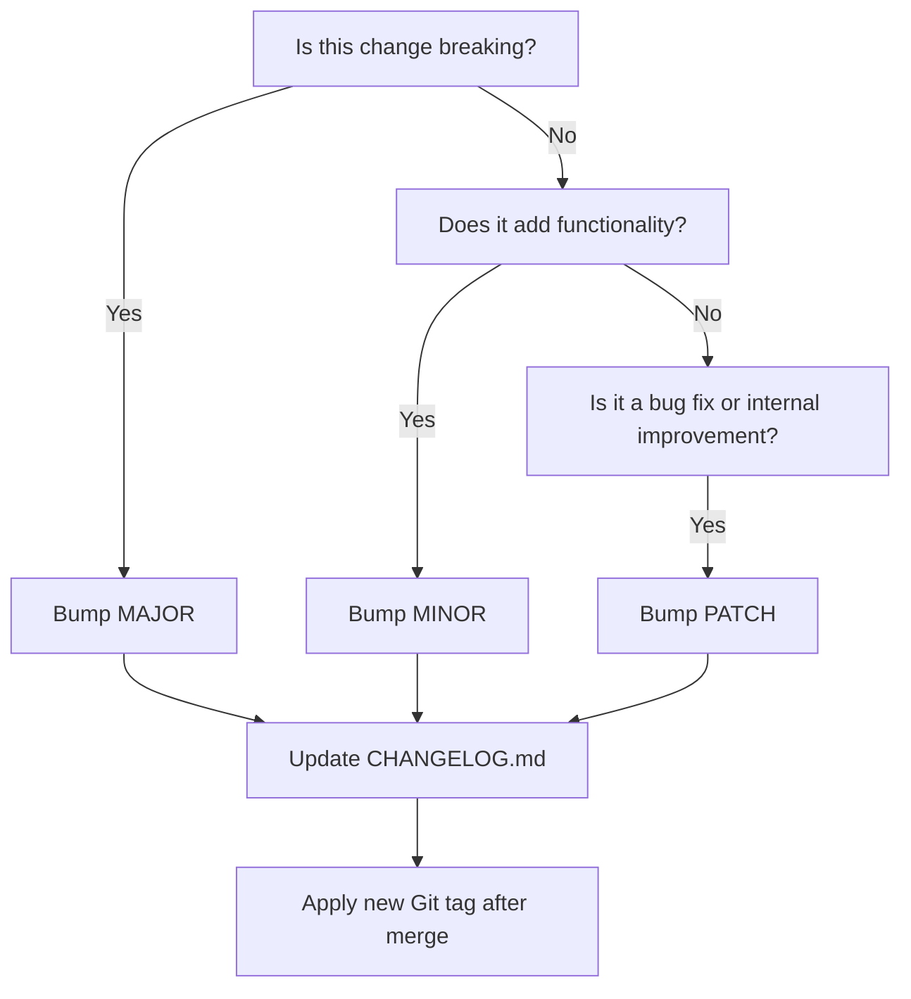

# Release a Version

This is the process for shipping a change that affects the public API (`pipelines/`/`jobs/`) — see [Versioning Policy](../reference/versioning-policy.md) for what counts as MAJOR/MINOR/PATCH and what the public API is.

## Breaking Change Process

1. Evaluate whether the breaking change is truly necessary.
2. Increment the **major** version.
3. Document the change in the CHANGELOG (see [Update the Changelog](update-the-changelog.md)).
4. Add inline comments in the affected template files.
5. Provide a migration guide explaining how to upgrade.

## Tagging Releases

All changes must be tagged using Git in the format:

```bash
git tag -a 1.3.0 -m "Release 1.3.0 - Added support for dotnet 8"
git push origin 1.3.0
```

> Tags must be applied from the `main` branch only after validation. Tags are immutable `MAJOR.MINOR.PATCH` values — never a moving tag such as `v1`, and never re-pointed once pushed.

## Checklist for Versioning a Change


