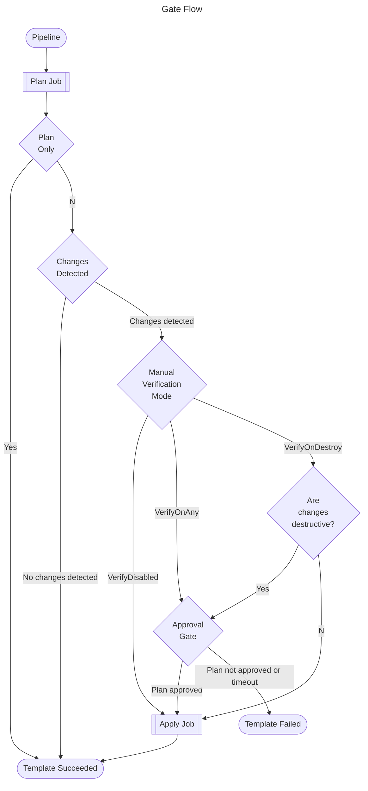

# How does this template work?

This template allows a pipeline to deploy resources via Terraform with an optional manual verification step, aka gate, for any resources planned to be changed. This functionality is controlled by a parameter to the template called `RunMode` and it has four settings: PlanOnly, don't trigger the gate or apply stage; VerifyDisable, don't trigger the gate at all; VerifyOnDestroy; trigger the gate only if the changes are destructive; and VerifyOnAny, trigger the gate for adds, changes, and deletions. If the Terraform `plan` indicates that any resources will be changed, then the `RunMode` will be checked and the appropriate verification taken, if no resources will be changed then the `apply` will not be called. If the gate is triggered, then authorised users will need to approve in Azure DevOps in order to move on to the `apply` step. The gate will fail the pipeline if either rejected or times out.

The template is broken into three jobs:

- plan job
- gate (manual verification) job
- apply job

The flow works as follows

