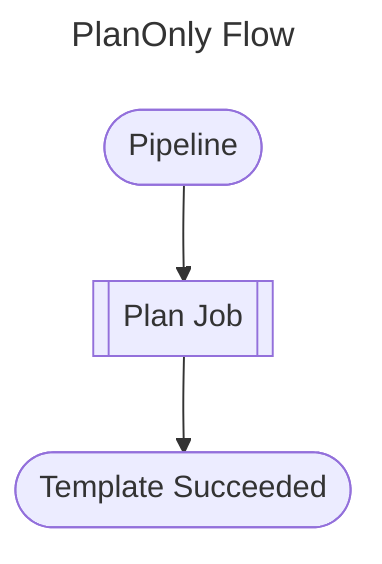
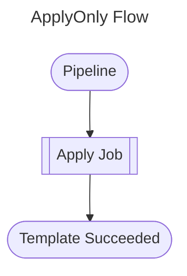
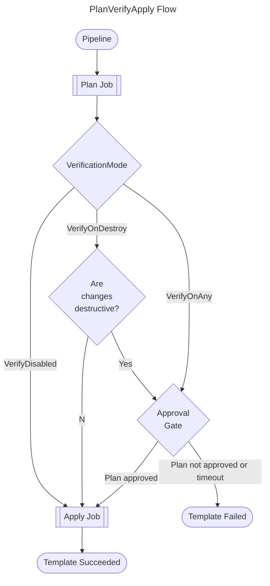

# Infrastructure Pipeline Manual Verification

This template allows a pipeline to deploy resources via Terraform with an optional manual verification step, aka gate, for any resources planned to be changed. This functionality is controlled by two parameters: a `RunMode` parameter, and a `VerificationMode` parameter. The `RunMode` parameter has three settings:

- `PlanOnly`: Runs only the Terraform `plan` and does not trigger the gate or the `apply` stage
- `PlanVerifyApply`: Runs the Terraform `plan`, applies verification logic based on `VerificationMode`, and then runs `apply`
- `ApplyOnly`: Skips the plan step and applies the configuration directly

When `RunMode` is `PlanOnly`, the pipeline terminates after the plan step. When `RunMode` is `ApplyOnly`, the configuration is applied directly without any verification. When `RunMode` is `PlanVerifyApply`, the `VerificationMode` parameter determines how the gate behaves and has three settings:

- `VerifyDisabled`: Do not trigger the gate at all; apply changes automatically
- `VerifyOnDestroy`: Trigger the gate only if the changes are destructive
- `VerifyOnAny`: Trigger the gate for adds, changes, and deletions

If the Terraform `plan` indicates that any resources will be changed (in `PlanVerifyApply` mode), then `VerificationMode` will be checked and the appropriate verification taken; if no resources will be changed then the `apply` will not be called. If the gate is triggered, then authorised users will need to approve in Azure DevOps in order to move on to the `apply` step. The gate will fail the pipeline if either rejected or times out.

The template is broken into three jobs:

- plan job (runs only in `PlanVerifyApply` and `PlanOnly` modes)
- gate (manual verification) job (runs only in `PlanVerifyApply` mode)
- apply job (runs only in `PlanVerifyApply` and `ApplyOnly` modes)

## RunMode Flows

The flow depends on the `RunMode` setting. Below are the three possible execution flows:

### PlanOnly Flow

When `RunMode` is set to `PlanOnly`, the pipeline runs the plan job and then terminates without applying any changes:

### ApplyOnly Flow

When `RunMode` is set to `ApplyOnly`, the pipeline skips the plan step and applies the configuration directly:

### PlanVerifyApply Flow

When `RunMode` is set to `PlanVerifyApply`, the pipeline runs the plan job, detects changes, applies verification logic based on `VerificationMode`, and then runs the apply job:

