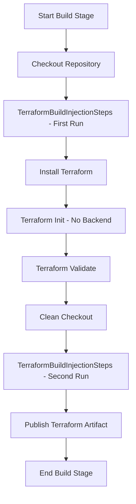
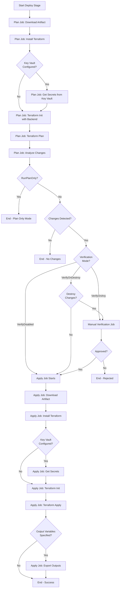

# Infrastructure Pipeline - Template Breakdown

This document provides a complete breakdown of all templates used by the infrastructure pipeline. These are the building blocks that make up the pipeline.

## Pipeline Structure

```
infrastructure_pipeline.yml
├── stages/terraform_build.yml
│   └── jobs/terraform_build.yml
│       ├── tasks/terraform_installer.yml
│       ├── tasks/terraform.yml (init, validate)
│       └── tasks/publish_pipeline_artifact.yml
└── stages/terraform_deploy.yml
    ├── jobs/terraform_deploy.yml (Plan mode)
    │   ├── tasks/download_pipeline_artifact.yml
    │   ├── tasks/terraform_installer.yml
    │   ├── tasks/azure_key_vault.yml (conditional)
    │   ├── tasks/terraform.yml (init, plan)
    │   ├── tasks/powershell.yml (terraform_changes_check.ps1)
    │   └── utils/concat_wrap_list.yml
    ├── jobs/manual_verification.yml (conditional)
    │   ├── tasks/delay.yml
    │   └── tasks/manual_validation.yml
    └── jobs/terraform_deploy.yml (Apply mode, conditional)
        ├── tasks/download_pipeline_artifact.yml
        ├── tasks/terraform_installer.yml
        ├── tasks/azure_key_vault.yml (conditional)
        ├── tasks/terraform.yml (init, apply, output)
        ├── tasks/powershell.yml (terraform_export_outputs.ps1)
        └── utils/concat_wrap_list.yml
```

## Stages

| Template                 | Location  | Purpose                                            | Key Features                                                                                                                             |
|--------------------------|-----------|----------------------------------------------------|------------------------------------------------------------------------------------------------------------------------------------------|
| **terraform_build.yml**  | `stages/` | Validates and packages Terraform files             | • Runs on self-hosted agent<br>• Executes injection steps twice<br>• Validates without backend<br>• Publishes artifact                   |
| **terraform_deploy.yml** | `stages/` | Orchestrates deployment with optional verification | • Creates stage per environment<br>• Coordinates Plan/Verify/Apply jobs<br>• Handles conditional execution<br>• Manages job dependencies |

## Jobs

| Template                    | Location | Purpose                           | Key Features                                                                                                               |
|-----------------------------|----------|-----------------------------------|----------------------------------------------------------------------------------------------------------------------------|
| **terraform_build.yml**     | `jobs/`  | Executes build operations         | • Checks out code twice (before/after validation)<br>• Runs injection steps<br>• Validates Terraform<br>• Creates artifact |
| **terraform_deploy.yml**    | `jobs/`  | Executes plan or apply operations | • Deployment job type<br>• Two modes: Plan and Apply<br>• Variable mappings support<br>• Environment association           |
| **manual_verification.yml** | `jobs/`  | Provides approval gate            | • Server-based job (no agent)<br>• Configurable timeout<br>• Custom instructions<br>• Conditional execution                |

## Tasks

| Template                           | Location | Azure DevOps Task          | Purpose                          | Parameters                                                                                                                                                                 |
|------------------------------------|----------|----------------------------|----------------------------------|----------------------------------------------------------------------------------------------------------------------------------------------------------------------------|
| **terraform_installer.yml**        | `tasks/` | TerraformInstaller@1       | Installs Terraform CLI           | • TerraformVersion<br>(default: `1.14.x`)                                                                                                                                  |
| **terraform.yml**                  | `tasks/` | TerraformTask@5            | Executes Terraform commands      | • Command (init/plan/apply/validate/output/destroy)<br>• CommandOptions<br>• BackendAzure* (5 params)<br>• EnvironmentAzureServiceConnection<br>• TaskEnvironmentVariables |
| **publish_pipeline_artifact.yml**  | `tasks/` | PublishPipelineArtifact@1  | Publishes build artifacts        | • ArtifactName<br>• TargetPath                                                                                                                                             |
| **download_pipeline_artifact.yml** | `tasks/` | DownloadPipelineArtifact@2 | Downloads pipeline artifacts     | • ArtifactName<br>• ItemPattern<br>• TargetPath                                                                                                                            |
| **azure_key_vault.yml**            | `tasks/` | AzureKeyVault@2            | Retrieves secrets from Key Vault | • KeyVaultServiceConnection<br>• KeyVaultName<br>• SecretsFilter                                                                                                           |
| **powershell.yml**                 | `tasks/` | PowerShell@2               | Runs PowerShell scripts          | • TargetType (filePath/inline)<br>• ScriptFilePath<br>• ScriptFileArguments<br>• TaskEnvironmentVariables                                                                  |
| **delay.yml**                      | `tasks/` | Delay@1                    | Pauses pipeline execution        | • delayForMinutes                                                                                                                                                          |
| **manual_validation.yml**          | `tasks/` | ManualValidation@1         | Requests manual approval         | • TimeoutInMinutes<br>• Instructions<br>• NotifyUsers<br>• Approvers                                                                                                       |

## Utilities

| Template                 | Location | Purpose                                    | Parameters                                              | Output                                  |
|--------------------------|----------|--------------------------------------------|---------------------------------------------------------|-----------------------------------------|
| **concat_wrap_list.yml** | `utils/` | Concatenates list items with prefix/suffix | • Items<br>• Prefix<br>• Suffix<br>• OutputVariableName | Variable containing concatenated string |

## Scripts

| Script                           | Location             | Purpose                                                                             | Used By                           | Parameters                                    |
|----------------------------------|----------------------|-------------------------------------------------------------------------------------|-----------------------------------|-----------------------------------------------|
| **terraform_changes_check.ps1**  | `scripts/terraform/` | Analyzes Terraform plan for changes and determines if manual verification is needed | terraform_deploy.yml (Plan mode)  | • VerificationMode<br>• TerraformPlanFilePath |
| **terraform_export_outputs.ps1** | `scripts/terraform/` | Extracts Terraform outputs and exports as pipeline variables                        | terraform_deploy.yml (Apply mode) | • OutputVariablesToExport<br>• OutputFileName |

## Template Relationships

### Build Stage Flow

1. **Stage**: `terraform_build.yml` creates "Build" stage
2. **Job**: `terraform_build.yml` runs on agent
3. **Tasks**:
   - Checkout repository
   - Run `TerraformBuildInjectionSteps` (user-provided)
   - Install Terraform (`terraform_installer.yml`)
   - Initialize Terraform without backend (`terraform.yml`)
   - Validate Terraform (`terraform.yml`)
   - Clean checkout
   - Run `TerraformBuildInjectionSteps` again
   - Publish artifact (`publish_pipeline_artifact.yml`)

### Deploy Stage Flow

1. **Stage**: `terraform_deploy.yml` creates "Deploy_{Environment}_Infrastructure" stage
2. **Job 1** (Plan): `terraform_deploy.yml` in Plan mode
   - Downloads artifact (`download_pipeline_artifact.yml`)
   - Installs Terraform (`terraform_installer.yml`)
   - Retrieves Key Vault secrets if configured (`azure_key_vault.yml`)
   - Initializes Terraform with backend (`terraform.yml`)
   - Creates execution plan (`terraform.yml`)
   - Analyzes plan for changes (`powershell.yml` + `terraform_changes_check.ps1`)
   - Sets output variables for job coordination
3. **Job 2** (Manual Verification): `manual_verification.yml` - **Conditional**
   - Only runs if `RunPlanOnly=false` AND changes need verification
   - Adds delay (`delay.yml`)
   - Requests approval (`manual_validation.yml`)
4. **Job 3** (Apply): `terraform_deploy.yml` in Apply mode - **Conditional**
   - Only runs if `RunPlanOnly=false` AND either verified or no verification needed
   - Downloads artifact (`download_pipeline_artifact.yml`)
   - Installs Terraform (`terraform_installer.yml`)
   - Retrieves Key Vault secrets if configured (`azure_key_vault.yml`)
   - Initializes Terraform with backend (`terraform.yml`)
   - Applies changes (`terraform.yml`)
   - Exports outputs if specified (`terraform.yml` + `powershell.yml` + `terraform_export_outputs.ps1`)

## Customization Points

The pipeline provides several extension points where you can inject custom behavior:

| Extension Point                          | Type     | Location                       | Use Case                                                                            |
|------------------------------------------|----------|--------------------------------|-------------------------------------------------------------------------------------|
| **TerraformBuildInjectionSteps**         | stepList | Build stage, before validation | Modify Terraform files, generate configuration, retrieve secrets                    |
| **DeploymentJobsVariableMappings**       | object   | Deploy stage jobs              | Add variables, variable groups, or variable templates to deployment jobs            |
| **TerraformEnvironmentVariableMappings** | object   | All Terraform tasks            | Pass environment variables to Terraform (e.g., ARM credentials, TF_VAR_* variables) |

## Template Execution Order

### Build Stage



### Deploy Stage (Full Flow)



## Self-Documenting Templates

All task, job, and stage templates in this repository are self-documenting with:
- Detailed comment headers explaining purpose and usage
- Complete parameter documentation with types and defaults
- Usage examples
- Notes about limitations or special behaviors

You can view any template in the repository to understand its full capabilities beyond what the infrastructure pipeline exposes.

## Template Inventory

### Complete List

This infrastructure pipeline uses **14 templates** and **2 scripts**:

**Stages (2)**:
- `stages/terraform_build.yml`
- `stages/terraform_deploy.yml`

**Jobs (3)**:
- `jobs/terraform_build.yml`
- `jobs/terraform_deploy.yml`
- `jobs/manual_verification.yml`

**Tasks (8)**:
- `tasks/terraform_installer.yml`
- `tasks/terraform.yml`
- `tasks/publish_pipeline_artifact.yml`
- `tasks/download_pipeline_artifact.yml`
- `tasks/azure_key_vault.yml`
- `tasks/powershell.yml`
- `tasks/delay.yml`
- `tasks/manual_validation.yml`

**Utilities (1)**:
- `utils/concat_wrap_list.yml`

**Scripts (2)**:
- `scripts/terraform/terraform_changes_check.ps1`
- `scripts/terraform/terraform_export_outputs.ps1`

## See Also

- [Infrastructure Pipeline Documentation](infrastructure_pipeline.md) - Main documentation
- [Infrastructure Pipeline Parameters](infrastructure_pipeline_parameters_in_detail.md) - Parameter reference
- [Manual Verification](infrastructure_pipeline_manual_verification.md) - How the approval gate works

